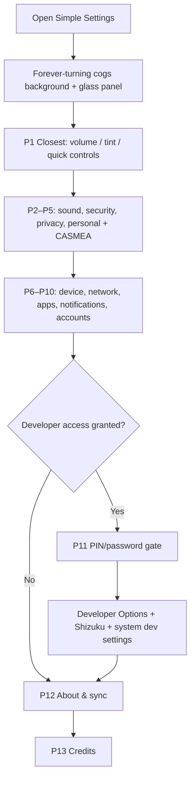

# Simple Settings — master settings app vision

**Repo:** `cowlsly_console_simple_settings_repo_03`  
**Last updated:** 2026-07-08  
**Status:** North-star design — Phase 1 shipped in `app/`; this doc holds the full picture.

## Why it is called Simple Settings

**Simple** does not mean *limited*. It means the settings you need most are **closest to you** — at the top, in one place, in priority order — so you never dig through five Android menus to change volume, privacy, or security.

One endless panel deck. Most-used controls on **page 1**; second-most-used on page 2; and so on. Forward and previous buttons (with pressed states and sounds) page through until you reach the end — including credits. No hunting.

## One app, every layer

Simple Settings is the **master settings hub** for the Cowlsly Console suite and the device it runs on.

| Layer | What Simple Settings owns |
|-------|---------------------------|
| **Closest** | Volume, mute, panel tint, brightness feel, quick sound/display tweaks |
| **Console** | Cowlsly look-and-feel shared across Vault, CASMEA, Cowlsly.com |
| **Personal** | Profile basics, CASMEA medical info entry (single source of truth) |
| **Security & privacy** | Lock methods, biometrics, permissions overview, privacy shortcuts |
| **Device** | Every regular Android settings category — led from one menu |
| **Developer** | Gated section; opens Developer Options when access is granted |

Other Cowlsly apps **include or deep-link** into Simple Settings instead of rebuilding their own settings screens.

## Design feel

- Cyberpunk neon glass panels over the **forever-turning cog machine** background.
- Cowlsly small logo in headers. See `Cowlsly/BRANDING.md`.
- Calm readability: security and privacy sections stay clear, not decorative clutter.
- **Page-turner navigation** on all form factors: glass panels over the forever-turning cogs; Previous / Next with pressed states and UI sounds.
- **Search bar** at the top — any user, advanced, developer, or tool setting. Search frequency feeds the same usage rank as opens.
- **Dynamic order**: the more a panel is opened or searched, the closer it moves to page 1.

## The settings pages — priority order

Page 1 = closest to you. Later pages = deeper system layers. **Base priority never changes without updating this doc and `SettingsCatalog`; usage/search scores reorder within that.**

| Mechanism | Rule |
|-----------|------|
| `basePriority` | P1 closest … P13 credits last |
| `open` events | +3 rank boost per open |
| `search` hits | +2 rank boost per search |
| Page size | 6 panels per page (phone) |

| P | Zone | What the user gets |
|---|------|-------------------|
| **0 (pinned)** | **Cowlsly Console** | Logo fave button on page 1 only — always opens Cowlsly Console Settings on cowlsly.com (make an account welcome) |
| **1** | **Closest to you** | Volume (mute + 0/25/50/75/90% steps, hearing warning), panel colour tint, quick brightness feel |
| **2** | **Sound & display** | Media volume link, notification tone link, display/text size shortcuts |
| **3** | **Security** | PIN, password, fingerprint toggles; lock-on-background; screen lock timeout link |
| **4** | **Privacy** | Permissions hub, location/camera/mic overview, privacy dashboard link, app data controls |
| **5** | **Personal info** | Username, email, avatar; **CASMEA medical entry** (edits only here, not in CASMEA app) |
| **6** | **Network & connectivity** | Wi‑Fi, mobile data, Bluetooth, NFC, hotspot — system intents |
| **7** | **Device** | Storage, battery, date/time, language, accessibility — system intents |
| **8** | **Apps** | Installed apps list, default apps, special access — system intents |
| **9** | **Notifications** | Per-app notification settings, Do Not Disturb link |
| **10** | **Accounts & backup** | Google/system accounts, backup, sync status links |
| **11** | **Developer** | Hidden until access granted; PIN/password re-entry; then Developer Options + USB debugging links |
| **12** | **About & sync** | App version, Cowlsly identity, website settings JSON export/import |
| **13** | **Credits** | Fair credit to Shizuku, Hidden Settings, Activity Launcher, and other external apps whose patterns we surface |



## Security & privacy — in detail

### In-app (Simple Settings stores or toggles)

- PIN / password / biometric enablement
- Lock when app goes to background
- Clipboard auto-clear preference (suite-wide)
- CASMEA field visibility flags (what shows on lock-screen emergency card)
- Developer section visibility flag (off by default)

### System-led (intents — we open Android settings, not duplicate them)

| Category | Android entry |
|----------|---------------|
| Screen lock type | `Settings.ACTION_SECURITY_SETTINGS` |
| App permissions | `Settings.ACTION_APPLICATION_DETAILS_SETTINGS` per app |
| Privacy dashboard | `Settings.ACTION_PRIVACY_SETTINGS` (API 30+) |
| Location | `Settings.ACTION_LOCATION_SOURCE_SETTINGS` |
| Notification policy | `Settings.ACTION_NOTIFICATION_POLICY_ACCESS_SETTINGS` |

Simple Settings **surfaces** these in plain language with Cowlsly icons. It does not re-implement Android's private settings storage.

## Developer options — how they open

Developer controls are **never** on the main scroll by default.

### Step 1 — Grant developer access (one-time)

User enables **Developer access** inside Simple Settings → About. Requires PIN or password. Sets `developer_access_granted = true` locally.

> On many devices the user must also tap **Build number ×7** in Android About phone. Simple Settings shows that instruction and a direct link.

### Step 2 — Open developer section

After access is granted, **P11 Developer** appears in the scroll. Opening it requires **fresh PIN/password re-entry** (same rule as Vault key protection).

### Step 3 — Links inside developer section

| Control | Action |
|---------|--------|
| Developer Options | `Settings.ACTION_APPLICATION_DEVELOPMENT_SETTINGS` |
| USB debugging | Opens dev settings (user toggles there) |
| Wireless debugging | Link when API ≥ 30 |
| Cowlsly dev tools | Shortcut to internal debug screens (suite apps only) |

The developer shortcut icon (`simple_settings_developer_shortcut_icon_transparent.svg`) is used for this zone only.

## Regular device settings — full catalog

Simple Settings lists **every standard Android settings category** as a labelled row with icon. Tapping opens the system screen.

| Group | Examples |
|-------|----------|
| **Wireless** | Wi‑Fi, mobile network, aeroplane mode, data saver |
| **Connected devices** | Bluetooth, cast, NFC, USB |
| **Sound** | Volume, vibration, default notification sound |
| **Display** | Brightness, dark theme, font size, screen timeout |
| **Wallpaper & style** | Wallpaper, colour palette (system) |
| **Storage** | Free space, app storage, trash |
| **Battery** | Usage, battery saver, adaptive battery |
| **Apps** | All apps, default apps, unused apps |
| **Notifications** | App list, Bubbles, history |
| **Privacy** | Permission manager, privacy dashboard |
| **Location** | App location access |
| **Security** | Screen lock, encryption, trust agents |
| **Accounts** | Google and other accounts |
| **System** | Languages, date/time, gestures, backup |
| **Accessibility** | TalkBack, display size, captions |
| **Tips & support** | Help, feedback (links) |

Nothing is removed to keep the app "simple" — it is **organised**, not stripped down.

## Suite integration

| Consumer | What it pulls from Simple Settings |
|----------|-----------------------------------|
| **Cowlsly Vault** | P1 console UI, P3 security toggles, P11 developer gate pattern |
| **CASMEA** | P5 medical info fields (read-only in CASMEA app; edit only here) |
| **Cowlsly.com / home** | Console UI prefs + profile/security flags via `cowlsly_website_settings_sync.json` — **every change pushes live** to website + `content://com.cowlsly.simplesettings.sync/document` |
| **Authenticator** (future) | Identity + security layer from P3–P5 |

Vault keeps **ALI-Key secrets** in the keyring. Simple Settings never stores API keys.

## Phase map

| Phase | Delivers |
|-------|----------|
| **1 (now)** | Android app scaffold: paged panels, search, usage ranking, volume, CASMEA entry, developer gate, Shizuku stub, credits |
| **2** | Full P1–P2 scroll, system intent launcher for P6–P8 |
| **3** | Security & privacy hub (P3–P4) wired to suite lock model |
| **4** | Developer gate + P11 live links |
| **5** | Website sync JSON for console + profile fields |
| **6** | Embedded module SDK for other Cowlsly apps (Compose / intent) |

## Screen sketch (phone)

```text
┌─────────────────────────────────────┐
│  [Cowlsly logo]   Simple Settings   │
├─────────────────────────────────────┤
│  ▓▓ cogs background (looping) ▓▓    │
│  ┌─────────────────────────────┐    │
│  │ P1  VOLUME  [mute][====●--] │    │
│  │     ⚠ hearing-safe steps    │    │
│  │ P1  PANEL TINT  [slider]    │    │
│  ├─────────────────────────────┤    │
│  │ P3  SECURITY                │    │
│  │     PIN / password / finger │    │
│  ├─────────────────────────────┤    │
│  │ P4  PRIVACY                 │    │
│  │     Permissions  →          │    │
│  ├─────────────────────────────┤    │
│  │ P5  CASMEA INFO ENTRY  →    │    │
│  ├─────────────────────────────┤    │
│  │ P6  NETWORK & DEVICE  →     │    │
│  │     Wi‑Fi / Bluetooth / …   │    │
│  ├─────────────────────────────┤    │
│  │ P11 DEVELOPER (gated)  →    │    │
│  └─────────────────────────────┘    │
│   [◀ Previous]  Page 2/9  [Next ▶]  │
└─────────────────────────────────────┘
```

## Rules for builders and Marla

1. **Closest first** — if a setting is used daily, it belongs in P1–P2.
2. **Sync with the original source** — read live values from Android (`Settings.System/Secure/Global`, `AudioManager`); write back where the user grants control. Intent-only panels mirror read state and open the system app for edits.
3. **Permissions with instructions** — every permission is promoted to the user on page 1 with plain steps and thanks; nothing silent.
4. **Do not duplicate Android storage** — when write access is impossible, lead the user to the system screen (Shizuku for privileged paths).
5. **Protect mutations** — PIN/password/biometric required before security, personal, or developer changes.
6. **CASMEA edits only here** — emergency app is view-only on lock screen.
7. **Developer is gated twice** — grant access once, re-enter PIN each visit.
8. **Update docs from the app** — when implementation changes, update this file and `ROADMAP.md`.

## Related documents

- `ROADMAP.md` — active build phases
- `dev/dat/doc/ROADMAP.ORIGINAL.md` — founding context
- Vault `docs/cowlsly_settings_control.md` — three settings layers
- Vault `docs/settings_priority_memory.md` — priority rules (align P6–P9 with this vision)